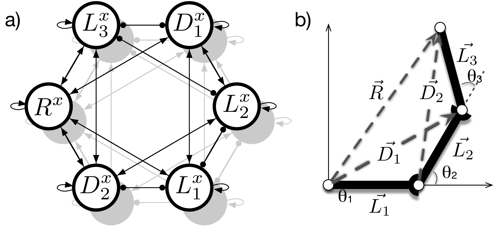

# MLP-Normalization Layers for Mean of Multiple Computation Neural Networks
Implementation of a (dynamic) functional internal body model that is based on the Mean of Multiple Computation principle in Python. 

--
### Summary
We present a functional internal body model that is based on the Mean of Multiple Computation principle. For the first time such a model is completely realized in a recurrent neural network as necessary normalization steps are integrated into the neural model itself. These normalization steps are realized as MLP layers. Comparison of different complexities of these subnetworks is given here. Furthermore, emerging representation in transformational layers are analyzed that show a form of prototypical population-coding as found in place or direction cells.

Secondly, a dynamic extension is applied to the model. It is shown how the neural network solves a series of inverse kinematic and dynamic tasks. 

--
### Requirements

The neural networks are realized in the keras framework (https://keras.io) which either requires [tensorflow](https://www.tensorflow.org) or [theano](http://deeplearning.net/software/theano/).

The scripts are in python and we used python 2.7. Pickle is used to save data from training runs and matplotlib for visualizing the data.

--
### Content

The repository consists mainly of three different sets of simulation. 

* 1\_Normalization\_MLPs/ - training and evaluation of the normalization sub-networks: a normalization network takes a noisy input vector and changes the length towards unit length (orientation should be kept the same). Here, we provide a comparison of different complexities of MLP-based subnetworks and find that already quite simple networks are sufficient to learn a good mapping. MLP models are saved here.
* 2\_Kinematic\_Full\_MMC/ - setup of an MMC-based body model for a three-segmented manipulator arm. The normalization subnetworks from above are integrated in order to realize the normalization step. Given are results for the kinematic MMC network.
* 3\_Dynamic\_Full\_MMC/ - extension of an MMC network through dynamic equations which leads to typical biological movement characteristics (again, using MLP-based normalization subnetworks).

--
### MMC approach

One example for an internal body model is realized by a Mean of Multiple Computations network (see [Schilling, 2011](https://link.springer.com/article/10.1007/s10514-011-9226-3) for example). The general structure of the neural network is not learned, but setup following the MMC principle. The model encodes geometric and kinematic constraints in a recurrent neural network. This shapes an attractor space that represents valid configurations of the manipulator structure. Importantly, diverse tasks can be given to the network which initially act as a disturbance on a previous state of the network, but which are resolved through spreading the disturbance through the network and settling in a new valid state. For example, an inverse kinematic problem can be solved by injecting a new position for the end effector into the network which requires the individual segments of the controlled structure to adapt towards new positions.

The Mean of Multiple Computation principle consists of two key ideas: first, the overall complexity of the controlled structure is broken down. As an example, we will use a three-segmented robotic arm. When the whole kinematic chain is expressed as one single equation, the problem becomes quite difficult for traditional control approaches. In the inverse kinematic task there are multiple possible configurations in order to reach a certain target position. Instead, the MMC principle breaks this down into multiple computations that consist of local relationships between variables. While the individual equations become trivial to solve (they only consist of three variables), we end up with multiple of such computations. As the second key idea, the MMC principle exploits this redundancy. As each variable appears in multiple computations, it depends on multiple of these equations. The MMC network works in an iterative fashion: an update for a variable is calculated using all the equations that affect this variable. The different multiple computations are integrated towards a new value - this is realized as a simple weighted mean calculation.

In the approach presented here, the normalization is now realized as a simple feedforward MLP sub-network that keeps the manipulator segments at constant lengths. The results for the internal body model show that this model is able to handle nicely inverse kinematics tasks and, furthermore, due to the dynamic extension is producing actions that show biological movement characteristics.

The analysis of the learned normalization layers revealed that these encode limb postures in a prototypical way - a population-based encoding of a posture emerges in the network. 
